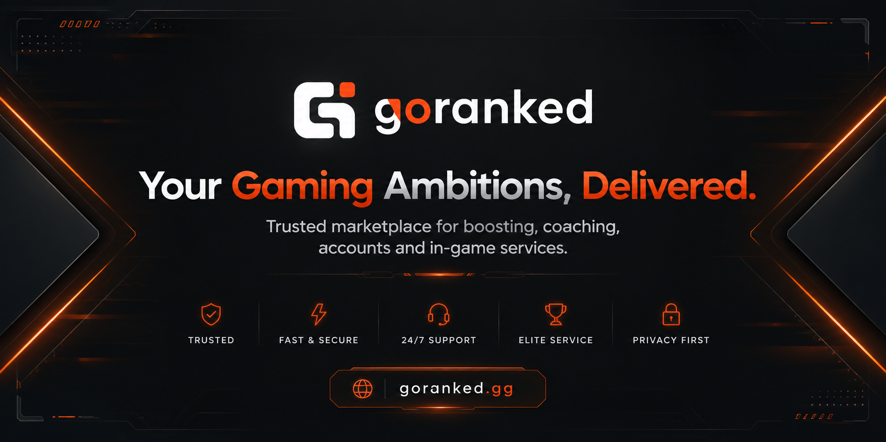
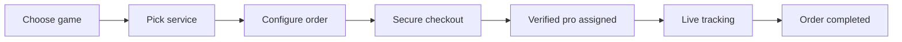
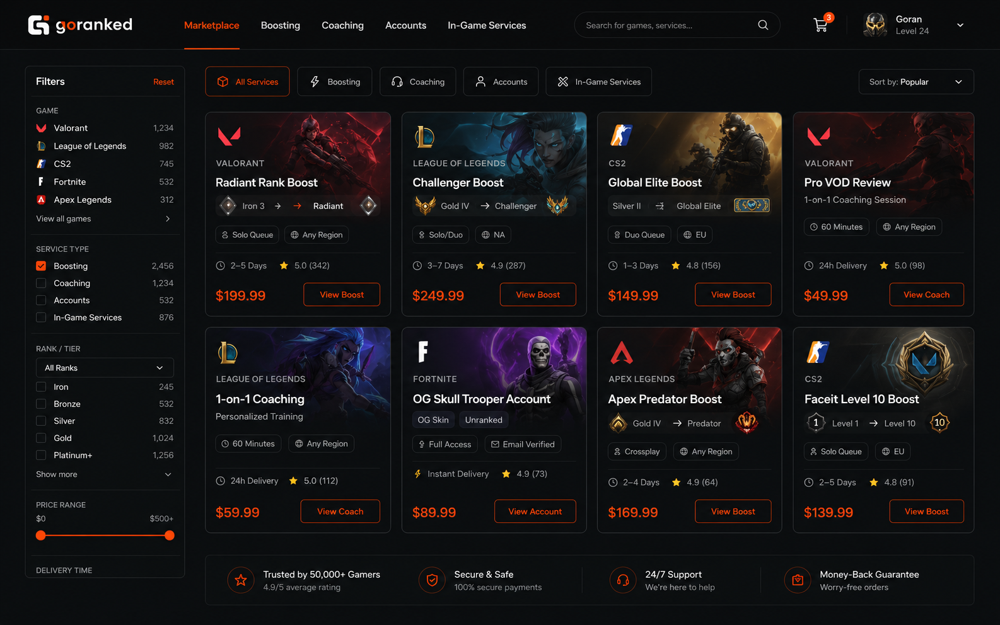
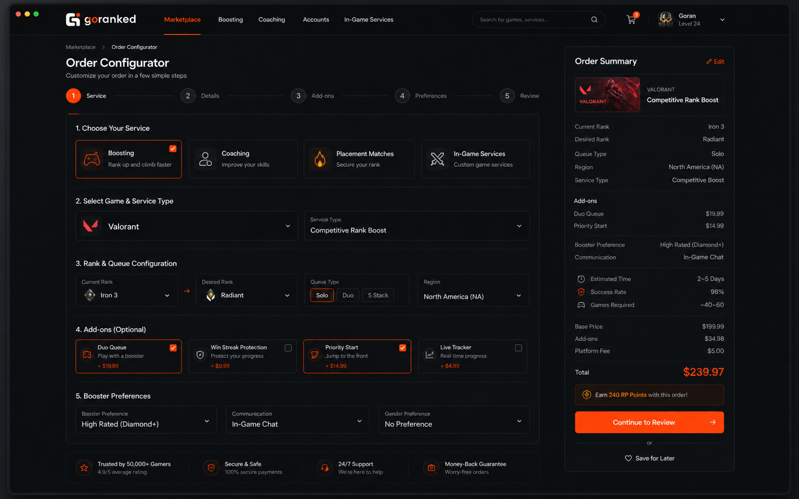
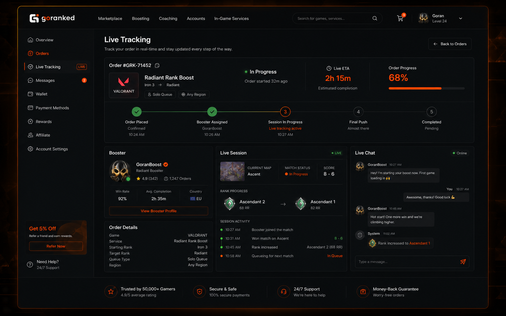

# Goranked.gg

### Your Gaming Ambitions, Delivered.

**A premium gaming marketplace for boosting, coaching, accounts and in-game services.**

 

 

  

<a href="#about">About</a>
&nbsp;•&nbsp;
<a href="#product-experience">Product Experience</a>
&nbsp;•&nbsp;
<a href="#services">Services</a>
&nbsp;•&nbsp;
<a href="#screenshots">Screenshots</a>
&nbsp;•&nbsp;
<a href="#trust--safety">Trust & Safety</a>
&nbsp;•&nbsp;
<a href="#roadmap">Roadmap</a>
&nbsp;•&nbsp;
<a href="#contact">Contact</a>

---

## About

**Goranked.gg** is a professional gaming marketplace that connects players with
verified boosters, coaches and sellers worldwide.

The platform is built around a simple promise: make gaming progression
**transparent, secure and easy to track**. Customers can choose a service,
configure the order, pay securely, follow progress in real time and communicate
with support from one place.

Goranked focuses on high-intent gaming services: rank boosting, coaching,
ready-to-play accounts, placement matches and custom in-game tasks.

---

## Executive Snapshot

<table>
<tr>
<td width="25%" align="center">
<h3>Marketplace</h3>

Boosting, coaching, accounts and in-game services in one storefront.

</td>
<td width="25%" align="center">
<h3>Live Tracking</h3>

Order progress, status updates and communication visible in real time.

</td>
<td width="25%" align="center">
<h3>Secure Checkout</h3>

Transparent pricing, protected payments and clear order flow.

</td>
<td width="25%" align="center">
<h3>Verified Pros</h3>

Services are fulfilled by reviewed boosters, coaches and sellers.

</td>
</tr>
</table>

---

## Product Experience

<table>
<tr>
<td width="33%" valign="top">
<h3>01 — Discover</h3>

Players browse available services by game, category, region, rank, delivery time and price.

</td>
<td width="33%" valign="top">
<h3>02 — Configure</h3>

Every order can be adjusted before checkout: current rank, target rank, queue type, add-ons and preferences.

</td>
<td width="33%" valign="top">
<h3>03 — Track</h3>

After payment, users can follow the order from assignment to completion with live updates.

</td>
</tr>
</table>

---

## Why Goranked

| Pillar | What it means |
|---|---|
| **Verified Professionals** | Boosters, coaches and sellers are reviewed before working with customers. |
| **Clear Pricing** | Customers see pricing logic and order options before checkout. |
| **Live Order Flow** | Progress is visible from the moment an order is created until completion. |
| **Human Support** | Support is available through the website for order help and dispute handling. |
| **Secure Payments** | Checkout is designed around protected transactions and buyer confidence. |
| **Marketplace Depth** | One ecosystem for boosting, coaching, accounts and custom gaming services. |

---

## Services

| Service | Purpose | Best for |
| :--- | :--- | :--- |
| **Rank / MMR Boost** | Climb from current rank to target rank | Players who want faster progression |
| **Coaching** | 1-on-1 improvement sessions | Players who want to improve skill, not only rank |
| **Account Marketplace** | Ready-to-play accounts with key attributes | Buyers who need a prepared account |
| **Placement / Calibration** | Optimised placement matches | New seasons, new accounts, fresh starts |
| **In-game Services** | Quests, achievements, farming, custom orders | Players who need task-based help |

---

## Supported Games

<table>
<tr>
<td align="center" width="150">
 
<b>Dota 2</b> 
MMR boost · Calibration · Coaching
</td>
<td align="center" width="150">
 
<b>Counter-Strike 2</b> 
Premier · Faceit · Accounts
</td>
<td align="center" width="150">
 
<b>League of Legends</b> 
Solo/Duo · Flex · Coaching
</td>
<td align="center" width="150">
 
<b>Valorant</b> 
Rank boost · Placements
</td>
</tr>
<tr>
<td align="center" width="150">
 
<b>Fortnite</b> 
Wins · Quests · Services
</td>
<td align="center" width="150">
 
<b>Mobile Legends</b> 
Rank push · Mythic boost
</td>
<td align="center" width="150">
 
<b>World of Warcraft</b> 
Mythic+ · Raids · Leveling
</td>
<td align="center" width="150">
 
<b>Clash of Clans</b> 
TH push · Hero levels · Wars
</td>
</tr>
</table>

> More titles are added as demand grows. Don't see your game? [Contact us](#contact).

---

## Screenshots

<table>
<tr>
<th>Marketplace</th>
<th>Order Configurator</th>
<th>Live Tracking</th>
</tr>
<tr>
<td width="33%">

</td>
<td width="33%">

</td>
<td width="33%">

</td>
</tr>
</table>

<i>Click any preview to open the full-size product screenshot.</i>

---

## Platform Highlights

<table>
<tr>
<td width="50%" valign="top">

### For Players

- Browse gaming services by title, category and rank.
- Configure order details before checkout.
- Track order status and completion progress.
- Communicate with support through the platform.
- Use a secure and transparent order flow.

</td>
<td width="50%" valign="top">

### For Professionals

- Structured marketplace listing system.
- Clear order requirements before starting work.
- Dashboard-based order management.
- Review-driven reputation model.
- Long-term marketplace growth opportunities.

</td>
</tr>
</table>

---

## Trust & Safety

Goranked is designed around trust, order transparency and marketplace control.

| Layer | Protection |
|---|---|
| **Professional verification** | Sellers, boosters and coaches are reviewed before they can provide services. |
| **Order visibility** | Customers can follow order state, assignment and progress instead of waiting blindly. |
| **Payment confidence** | Secure checkout and clear pricing reduce friction and misunderstandings. |
| **Support process** | Order-related questions and disputes are handled through official support channels. |
| **Marketplace moderation** | Sellers and services can be reviewed, restricted or removed if needed. |

> Read customer reviews on [Trustpilot](https://www.trustpilot.com/review/goranked.gg).

---

## Brand System

| Token | Usage |
|---|---|
| **Flame Orange** | Primary action color, CTAs, highlights and energy accents |
| **Graphite / Black** | Premium dark interface, depth and contrast |
| **White / Foggy Graphite** | Text hierarchy, readability and clean spacing |
| **Gilroy / Open Sans** | Modern, readable, tech-oriented typography direction |

---

## Roadmap

- [x] Core marketplace experience
- [x] Service configuration flow
- [x] Live order tracking concept
- [x] Multi-language storefront
- [x] Expansion across major competitive titles
- [ ] Mobile-first customer account experience
- [ ] Public booster and seller reputation pages
- [ ] Advanced order analytics for internal operations
- [ ] Affiliate and creator program
- [ ] Expanded marketplace automation

---

## Contact

**Business**: GORANKED GLOBAL SERVICES OÜ  
**Support**: available through the on-site live chat  
**Press & Partnerships**: see the [About page](https://goranked.gg/en/about)

---

### Goranked.gg — *Your gaming ambitions, delivered.*

© Goranked Global Services. All trademarks belong to their respective owners.

